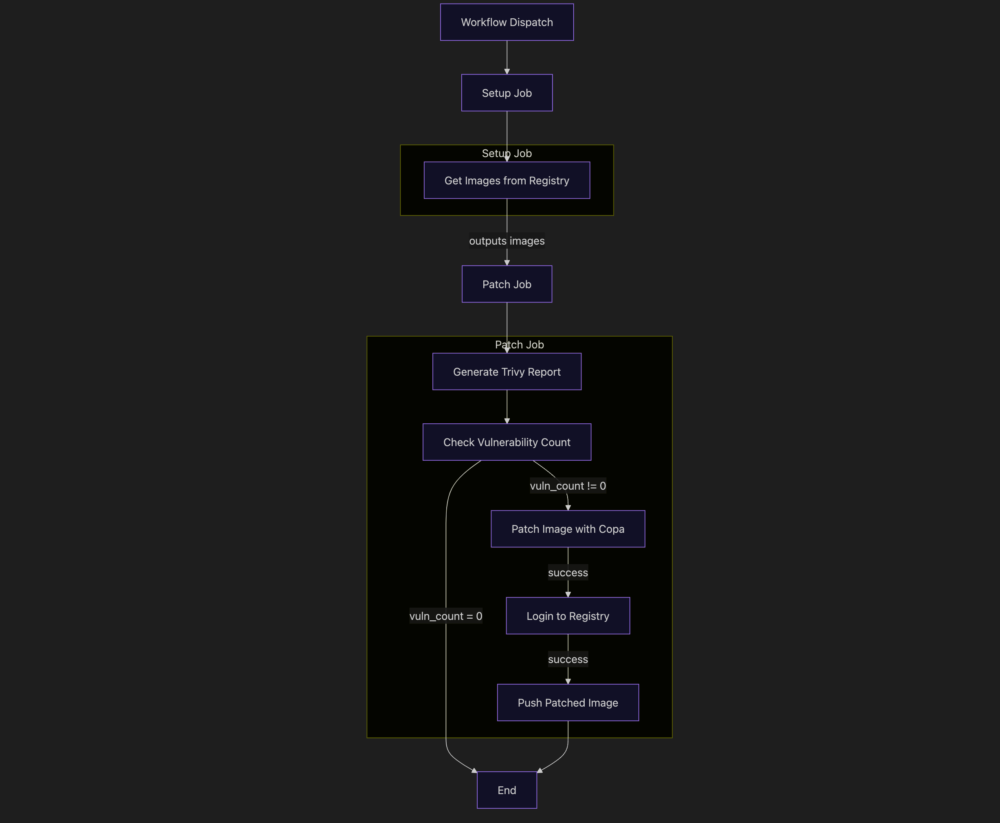

# ContainOps

This repository automates the process of scanning and patching container images from GitHub Container Registry (GHCR). The workflow ensures that images are continuously checked for vulnerabilities and updated when necessary.

## How to use this repository

### Create a new repository from the template

1. Click on the `Use this template` button to create a new repository.
2. Create a new repository from the template.

### Create a new PAT

1. Create a classic PAT (Personal Access Token) with the `repo` scope.
   - Go to `Settings` -> `Developer settings` -> `Personal access tokens` -> `Tokens (classic)`
   - Click on `Generate new token` -> `Generate new token (classic)`
   - Give the token a name and click `write:packages`

### Add secrets to the repository

1. Go to the repository you created from the template and click on `Settings` -> `Secrets and variables` -> `Actions`
2. Add the following secrets:
   - `GHCR_TOKEN`: The PAT you created in step 3.
3. Create another secret named `REGISTRY` and set it to `ghcr.io/<username>`.
   - Replace `<username>` with your GitHub username.

### Run the workflow

1. Go to the repository you created from the template and click on the `Actions` tab.
2. Click on the `continuous-patch` workflow and then click on the `Run workflow` button.

## How it works:

